# 无人机汇总

## 目录
- [1 环境配置报错与解决（虚拟机）](#1-环境配置报错与解决虚拟机)
- [2 云纵无人机环境配置](#2-云纵无人机环境配置)
  - [2.1 电脑系统配置](#21-电脑系统配置)
  - [2.2 安装ROS](#22-安装ros)
  - [2.3 安装PX4开发环境](#23-安装px4开发环境)
  - [2.4 安装Sunray项目依赖项](#24-安装sunray项目依赖项)
  - [2.5 安装编译Sunray项目](#25-安装编译sunray项目)
- [3 无人机启动步骤](#3-无人机启动步骤)
  - [3.1 前置准备](#31-前置准备)
  - [3.2 机载电脑连接网络](#32-机载电脑连接网络)
  - [3.3 NoMachine连接机载电脑](#33-nomachine连接机载电脑)
  - [3.4 接入动捕系统](#34-接入动捕系统)
  - [3.5 运行示例程序](#35-运行示例程序)
  

## 1 环境配置报错与解决（虚拟机）

#### 报错1：
> Installing PX4 Python3 dependencies
Collecting argcomplete
  Using cached argcomplete-3.6.3-py3-none-any.whl (43 kB)
Collecting argparse>=1.2
  Using cached argparse-1.4.0-py2.py3-none-any.whl (23 kB)
Collecting cerberus
  Using cached Cerberus-1.3.7-py3-none-any.whl (30 kB)
ERROR: Could not find a version that satisfies the requirement coverage (from -r /home/zq/sunray_px4/Tools/setup/requirements.txt (line 4)) (from versions: none)
ERROR: No matching distribution found for coverage (from -r /home/zq/sunray_px4/Tools/setup/requirements.txt (line 4))

显示如上问题。
#### 解决1：
这是 PX4 的 Python 依赖安装问题，主要是 coverage 包找不到。让我们解决这个问题：
```
# 升级 pip
pip3 install --upgrade pip

# 更换为清华源
pip3 config set global.index-url https://pypi.tuna.tsinghua.edu.cn/simple
```

#### 报错2：
>Installing PX4 Python3 dependencies
ERROR: Invalid requirement: 'matplotlib>=3.0.*': .* suffix can only be used with `==` or `!=` operators
    matplotlib>=3.0.*
              ~~~~~~^ (from line 11 of /home/zq/sunray_px4/Tools/setup/requirements.txt)
#### 解决2：
这个错误是因为 requirements.txt 中的版本语法不正确。matplotlib>=3.0.* 这种写法在较新版本的 pip 中不被支持。让我们修复这个问题：
```
# 修复版本语法
sed -i 's/matplotlib>=3.0\.\*/matplotlib>=3.0/g' /home/zq/sunray_px4/Tools/setup/requirements.txt

重新安装依赖
cd /home/zq/sunray_px4

# 使用国内镜像源安装
pip3 install -i https://pypi.tuna.tsinghua.edu.cn/simple -r Tools/setup/requirements.txt
```

#### 报错3：
出现如下错误
> Could not find a package configuration file provided by "octomap_msgs" with
  any of the following names:
    octomap_msgsConfig.cmake
    octomap_msgs-config.cmake
make: *** No targets specified and no makefile found.  Stop.
make: *** No targets specified and no makefile found.  Stop.
================================
[DEBUG] make exit code: 2
catkin构建失败: sunray_ugv_control (make failed with exit code: 2)
[错误] 模块构建失败: sunray_ugv_control
[失败] 18/21: sunray_ugv_control

#### 解决3：
```
sudo apt-get install -y \
ros-noetic-octomap-msgs \
ros-noetic-octomap-ros \
ros-noetic-octomap-server \
ros-noetic-octomap-rviz-plugins
```

#### 报错4：

#### 解决4：
仿真不需要，硬件需要

**硬件环境下：**

方案1：安装 RKNN Toolkit（如果你有 Rockchip 设备）
```
# 创建第三方库目录
mkdir -p ~/libs
cd ~/libs

# 下载 RKNN Toolkit（需要从官方获取）
# 由于版权原因，需要从 Rockchip 官网下载
# 或者使用 wget 下载（如果知道下载链接）
# wget https://github.com/rockchip-linux/rknn-toolkit2/archive/refs/tags/v1.5.2.tar.gz

# 解压并安装
tar -xzf rknn-toolkit2-*.tar.gz
cd rknn-toolkit2-*

# 安装 Python 包
pip3 install -r requirements.txt
pip3 install .

# 设置头文件路径
export RKNN_API_PATH=~/libs/rknn-toolkit2-*/runtime/RKNN-RT2/rknn-api/include
```
**仿真环境下：**

方案2：临时注释掉 NPU 相关代码
```
cd /home/zq/Sunray/External_Module/sunray_detection

# 备份文件
cp detection_libs/src/inference_backend/npu/rknn/rknn_runner.h detection_libs/src/inference_backend/npu/rknn/rknn_runner.h.bak

# 在文件开头添加禁用宏
echo -e "#ifndef DISABLE_NPU\n#define DISABLE_NPU\n#endif\n\n$(cat detection_libs/src/inference_backend/npu/rknn/rknn_runner.h)" > detection_libs/src/inference_backend/npu/rknn/rknn_runner.h
```

#### 报错5：

#### 解决5：
```
sudo apt-get install -y \
    libsfml-dev \
    libsfml-system2.5 \
    libsfml-window2.5 \
    libsfml-graphics2.5 \
    libsfml-audio2.5 \
    libsfml-network2.5
```

#### 报错6：


#### 解决6：
清理所有ros进程
```
pkill -f roscore
pkill -f roslaunch
pkill -f rosmaster
sleep 2
roscore
```

## 2 云纵无人机环境配置
**参考教程：** https://wiki.yundrone.cn/docs/Sunray-fang-zhen-kai-fa-huan-jing-pei-zhi
### 2.1 电脑系统配置
- 在电脑上安装Ubuntu20.04系统（安装方式三选一）
  - 安装ubuntu单系统或者ubuntu+windows双系统（推荐！）
  - 在windows中使用WSL的方式安装Ubuntu系统（一般推荐）
  - 在windows中使用虚拟机的方式安装Ubuntu系统（不推荐）
---
### 2.2 安装ROS
- 建议直接使用鱼香ROS的一键安装方式来安装ROS
  ``` bash
  wget http://fishros.com/install -O fishros && . fishros
  ```
- 安装完成之后通过roscore指令来确认是否正确安装ROS
  ``` bash
  roscore
  ```
---
### 2.3 安装PX4开发环境
#### 2.3.1 PX4源码配置
- 拉取px4仓库
  ``` bash
  git clone https://gitee.com/yundrone_sunray2023/sunray_px4.git
  ```
- 进入文件夹
  ``` bash
  cd sunray_px4
  ```
- 拉取子模块
  ``` bash
  git submodule update --init --recursive
  ```
- 安装依赖包 受网络原因肯能会失败多试几次
  ``` bash
  ./Tools/setup/ubuntu.sh
  ```
  > **<font color="#FF0000">报错：</font>**
  > 
  > 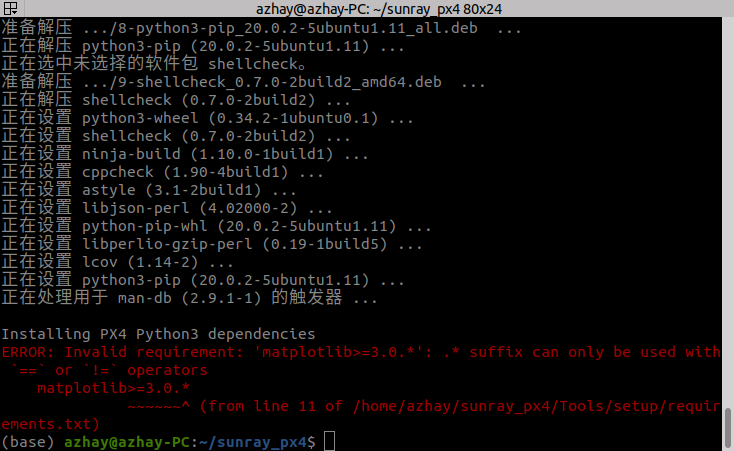
  > 
  > **<font color="#FF0000">解决：</font>**
  > 
  > 这个错误是因为 requirements.txt 中的版本语法不正确。matplotlib>=3.0.* 这种写法在较新版本的 pip 中不被支持。让我们修复这个问题：
  > - 修复版本语法
  > ``` bash
  > sed -i 's/matplotlib>=3.0\.\*/matplotlib>=3.0/g' ~/sunray_px4/Tools/setup/requirements.txt
  > ```
  > - 进入文件夹
  > ``` bash
  > cd sunray_px4
  > ```
  > - 使用国内镜像源安装
  > ``` bash
  > pip3 install -i https://pypi.tuna.tsinghua.edu.cn/simple -r Tools/setup/requirements.txt
  > ```
- 编译仿真
  ``` bash
  make px4_sitl_default gazebo
  ```
  > **<font color="#FF0000">报错：</font>**
  > 
  > 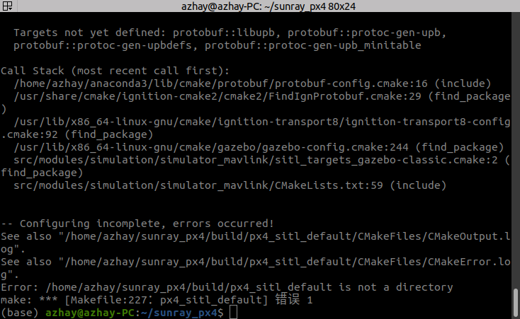
  > 
  > **<font color="#FF0000">解决：</font>**
  > 
  > 这个错误是因为上一步依赖包未安装全，再多安装几遍依赖
  > 或者是因为未退出conda虚拟环境
  > ``` bash
  > conda deactivate
  > pip3 install -i https://pypi.tuna.tsinghua.edu.cn/simple -r Tools/setup/requirements.txt
  > ```
#### 2.3.2 配置环境变量
- 打开环境变量配置文件
  ``` bash
  gedit ~/.bashrc
  ```
- 在文件结尾输入以下语句
  ``` text
  source ~/sunray_px4/Tools/simulation/gazebo-classic/setup_gazebo.bash ~/sunray_px4 ~/sunray_px4/build/px4_sitl_default
  export ROS_PACKAGE_PATH=$ROS_PACKAGE_PATH:~/sunray_px4/Tools/simulation/gazebo-classic/sitl_gazebo-classic
  export ROS_PACKAGE_PATH=$ROS_PACKAGE_PATH:~/sunray_px4
  ```
  > **<font color="#FF0000">报错：</font>**
  > 
  > 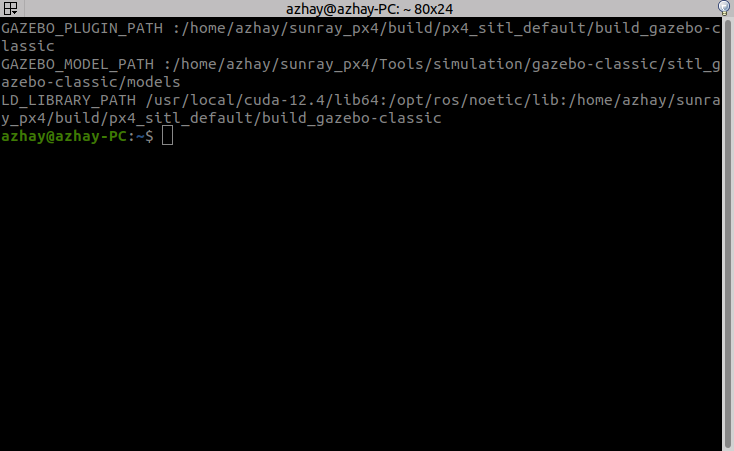
  > 
  > 问题是重复路径，原因是执行px4的setup_gazebo.bash脚本输出了GAZEBO_PLUGIN_PATH、GAZEBO_MODEL_PATH、LD_LIBRARY_PATH三个路径，后续其他的脚本可能再次追加了相同的路径，最终导致了重复输出
  > 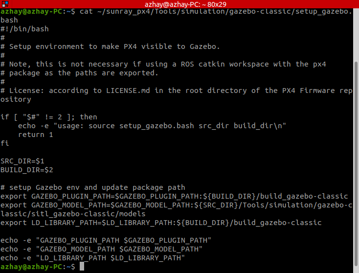
  > 
  > **<font color="#FF0000">解决(不确定对后续的影响)：</font>**
  > 
  > ``` bash
  > # 去掉这行：
  > # source ~/sunray_px4/Tools/simulation/gazebo-classic/setup_gazebo.bash ~/sunray_px4 ~/sunray_px4/build/px4_sitl_default
  > 
  > # 改为手动设置：
  > export GAZEBO_PLUGIN_PATH=$GAZEBO_PLUGIN_PATH:~/sunray_px4/build/px4_sitl_default/build_gazebo-classic
  > export GAZEBO_MODEL_PATH=$GAZEBO_MODEL_PATH:~/sunray_px4/Tools/simulation/gazebo-classic/sitl_gazebo-classic/models
  > export LD_LIBRARY_PATH=$LD_LIBRARY_PATH:~/sunray_px4/build/px4_sitl_default/build_gazebo-classic
  > ```
#### 2.3.3 安装MAVROS
- 使用二进制方式安装
  ``` bash
  sudo apt-get install ros-noetic-mavros*
  ```
- 安装GeographicLib (mavros的依赖库)
  ``` bash
  sudo /opt/ros/noetic/lib/mavros/install_geographiclib_datasets.sh
  ```
  * 这一步由于网络问题，安装时间会比较长，请耐心等待
  * 如果安装失败，可参考如下教程[install_geographiclib_datasets.sh](https://blog.csdn.net/weixin_41865104/article/details/119418901)
---
### 2.4 安装Sunray项目依赖项
- 安装VRPN，用于真机试验中获取动捕数据
  ``` bash
  sudo apt-get install ros-noetic-vrpn
  ```
---
### 2.5 安装编译Sunray项目
- 下载代码
  ``` bash
  git clone https://github.com/YunDrone-Team/Sunray.git
  ```
- 编译代码
  ``` bash
  cd Sunray
  ## 编译
  ./build.sh
  ```
  > 全选所有模块并开始编译构建
  > 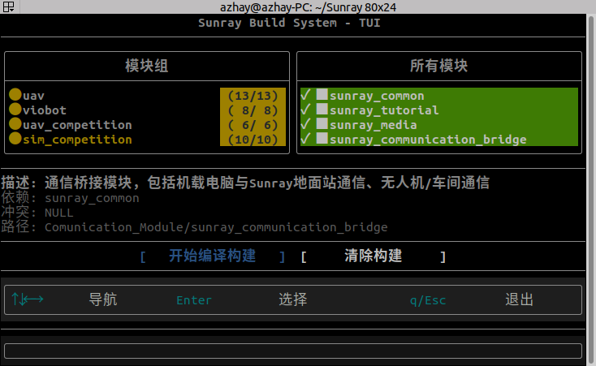
  > 
  > **<font color="#FF0000">报错：</font>**
  > 
  > 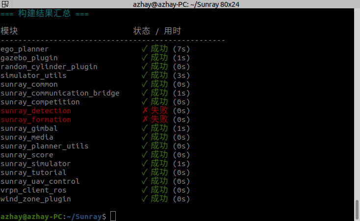
  > 
  > **<font color="#FF0000">1.解决sunray_detection构建失败：</font>**
  > 
  > 硬件需要，仿真不需要，可以先忽略该报错
  > **硬件环境下：**
  > 方案1：安装 RKNN Toolkit（如果你有 Rockchip 设备）
  > ``` bash
  > ## 创建第三方库目录
  > mkdir -p ~/libs
  > cd ~/libs
  > 
  > # 下载 RKNN Toolkit（需要从官方获取）
  > # 由于版权原因，需要从 Rockchip 官网下载
  > # 或者使用 wget 下载（如果知道下载链接）
  > wget https://github.com/rockchip-linux/rknn-toolkit2/archive/refs/tags/v1.5.2.tar.gz
  > 
  > # 解压并安装
  > tar -xzf rknn-toolkit2-*.tar.gz
  > cd rknn-toolkit2-*
  > 
  > # 安装 Python 包
  > pip3 install -r requirements.txt
  > pip3 install .
  > 
  > # 设置头文件路径
  > export RKNN_API_PATH=~/libs/rknn-toolkit2-*/runtime/RKNN-RT2/rknn-api/include
  > ```
  > **仿真环境下：**
  > 方案2：临时注释掉 NPU 相关代码
  > ``` bash
  > cd /home/zq/Sunray/External_Module/sunray_detection
  > 
  > # 备份文件
  > cp detection_libs/src/inference_backend/npu/rknn/rknn_runner.h detection_libs/src/inference_backend/npu/rknn/rknn_runner.h.bak
  > 
  > # 在文件开头添加禁用宏
  > echo -e "#ifndef DISABLE_NPU\n#define DISABLE_NPU\n#endif\n\n$(cat detection_libs/src/inference_backend/npu/rknn/rknn_runner.h)" > detection_libs/src/inference_backend/npu/rknn/rknn_runner.h
  > ```
  > 
  > **<font color="#FF0000">2.解决sunray_formation构建失败：</font>**
  > 
  > ``` bash
  > sudo apt-get install -y \
  >   libsfml-dev \
  >   libsfml-system2.5 \
  >   libsfml-window2.5 \
  >   libsfml-graphics2.5 \
  >   libsfml-audio2.5 \
  >   libsfml-network2.5
  > ```
- 写入环境变量
  ``` bash
  ## 打开环境变量文件
  gedit ~/.bashrc
  ## 写入环境变量
  source ~/Sunray/devel/setup.bash
  export GAZEBO_MODEL_PATH=$GAZEBO_MODEL_PATH:~/Sunray/Simulation/sunray_simulator/models
  export GAZEBO_MODEL_PATH=$GAZEBO_MODEL_PATH:~/Sunray/Simulation/sunray_simulator/models/scence_models
  export GAZEBO_MODEL_PATH=$GAZEBO_MODEL_PATH:~/Sunray/Simulation/sunray_simulator/models/sensor_models
  export GAZEBO_MODEL_PATH=$GAZEBO_MODEL_PATH:~/Sunray/Simulation/sunray_simulator/models/drone_models
  export GAZEBO_MODEL_PATH=$GAZEBO_MODEL_PATH:~/Sunray/Simulation/sunray_simulator/models/world_models
  export GAZEBO_MODEL_PATH=$GAZEBO_MODEL_PATH:~/Sunray/Simulation/sunray_simulator/models/ugv_models
  export GAZEBO_MODEL_PATH=$GAZEBO_MODEL_PATH:~/Sunray/Simulation/sunray_simulator/texture
  ## 刷新环境变量
  source ~/.bashrc
  ## 为了确认你的包路径已经设置，回显 ROS_PACKAGE_PATH 变量
  echo $ROS_PACKAGE_PATH
  ```
- 编译后运行以下指令确认安装成功
  ``` bash
  roslaunch sunray_simulator sunray_sim_1uav.launch
  ```
  > **<font color="#FF0000">报错1：</font>**
  > 
  > 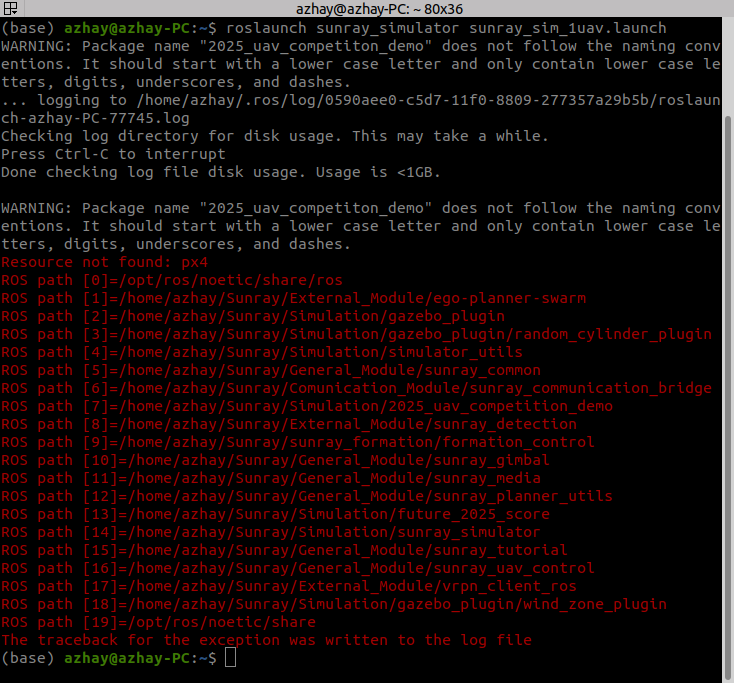
  > 
  > **<font color="#FF0000">解决1：</font>**
  > 
  > 这个错误是因为sunray_px4和Sunray环境配置路径顺序错误
  > ``` bash
  > ## 错误顺序：先完整设置 PX4 环境（source + export），然后设置 Sunray 环境（source + export）
  > source ~/sunray_px4/Tools/simulation/gazebo-classic/setup_gazebo.bash ~/sunray_px4 ~/sunray_px4/build/px4_sitl_default
  > export ROS_PACKAGE_PATH=$ROS_PACKAGE_PATH:~/sunray_px4/Tools/simulation/gazebo-classic/sitl_gazebo-classic
  > export ROS_PACKAGE_PATH=$ROS_PACKAGE_PATH:~/sunray_px4
  > 
  > source ~/Sunray/devel/setup.bash
  > export GAZEBO_MODEL_PATH=$GAZEBO_MODEL_PATH:~/Sunray/Simulation/sunray_simulator/models
  > export GAZEBO_MODEL_PATH=$GAZEBO_MODEL_PATH:~/Sunray/Simulation/sunray_simulator/models/scence_models
  > export GAZEBO_MODEL_PATH=$GAZEBO_MODEL_PATH:~/Sunray/Simulation/sunray_simulator/models/sensor_models
  > export GAZEBO_MODEL_PATH=$GAZEBO_MODEL_PATH:~/Sunray/Simulation/sunray_simulator/models/drone_models
  > export GAZEBO_MODEL_PATH=$GAZEBO_MODEL_PATH:~/Sunray/Simulation/sunray_simulator/models/world_models
  > export GAZEBO_MODEL_PATH=$GAZEBO_MODEL_PATH:~/Sunray/Simulation/sunray_simulator/models/ugv_models
  > export GAZEBO_MODEL_PATH=$GAZEBO_MODEL_PATH:~/Sunray/Simulation/sunray_simulator/texture
  > ```
  > ``` bash
  > ## 正确顺序：先初始化所有框架，后配置具体路径
  > source ~/sunray_px4/Tools/simulation/gazebo-classic/setup_gazebo.bash ~/sunray_px4 ~/sunray_px4/build/px4_sitl_default
  > source ~/Sunray/devel/setup.bash
  > 
  > export ROS_PACKAGE_PATH=$ROS_PACKAGE_PATH:~/sunray_px4/Tools/simulation/gazebo-classic/sitl_gazebo-classic
  > export ROS_PACKAGE_PATH=$ROS_PACKAGE_PATH:~/sunray_px4
  > 
  > export GAZEBO_MODEL_PATH=$GAZEBO_MODEL_PATH:~/Sunray/Simulation/sunray_simulator/models
  > export GAZEBO_MODEL_PATH=$GAZEBO_MODEL_PATH:~/Sunray/Simulation/sunray_simulator/models/scence_models
  > export GAZEBO_MODEL_PATH=$GAZEBO_MODEL_PATH:~/Sunray/Simulation/sunray_simulator/models/sensor_models
  > export GAZEBO_MODEL_PATH=$GAZEBO_MODEL_PATH:~/Sunray/Simulation/sunray_simulator/models/drone_models
  > export GAZEBO_MODEL_PATH=$GAZEBO_MODEL_PATH:~/Sunray/Simulation/sunray_simulator/models/world_models
  > export GAZEBO_MODEL_PATH=$GAZEBO_MODEL_PATH:~/Sunray/Simulation/sunray_simulator/models/ugv_models
  > export GAZEBO_MODEL_PATH=$GAZEBO_MODEL_PATH:~/Sunray/Simulation/sunray_simulator/texture
  > ```
  > 
  > **<font color="#FF0000">报错2：</font>**
  > 
  > 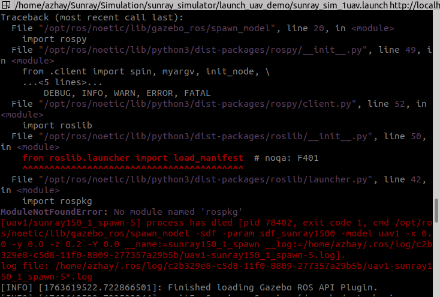
  > 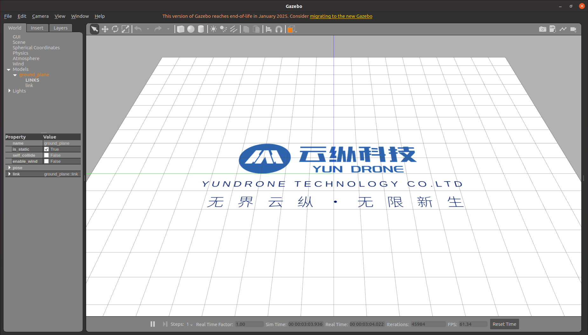
  > 
  > **<font color="#FF0000">解决2：</font>**
  > 
  > 这个错误是因为在conda虚拟环境下的ROS Python包未安装
  > ``` bash
  > ## 可以通过退出conda环境再运行(更建议)
  > conda deactivate
  > roslaunch sunray_simulator sunray_sim_1uav.launch
  > ```
  > ``` bash
  > ## 或者在conda环境下安装ROS Python包,再运行
  > conda activate base ## base为自定义环境名词
  > pip install rospkg catkin-pkg empy defusedxml
  > roslaunch sunray_simulator sunray_sim_1uav.launch
  > ```
---


## 3 无人机启动步骤 
### 3.1 前置准备
**下载链接：** https://www.nomachine.com/
- 下载NoMachine远程连接(Windows,Ubuntu均可)

---
### 3.2 机载电脑连接网络
**初次连接和更改网络需完成该步**
#### 3.2.1 供电连接显示器
- 使用原装电源给机载电脑供电，插入HDMI并连接显示器
#### 3.2.2 开机
- 按下开机键（某些机载设备上电自动开机），待设备开机进入桌面后连接WiFi，连接成功后查看IP地址(指令：ip a)
- P.S如果遇到上电开机很久显示器还是没有显示，但是按钮风扇都有启动的情况，尝试以下操作：

&emsp;&emsp;a.在上电开机的状态下按下重置按钮，此时电脑会断电关机
<div align=center>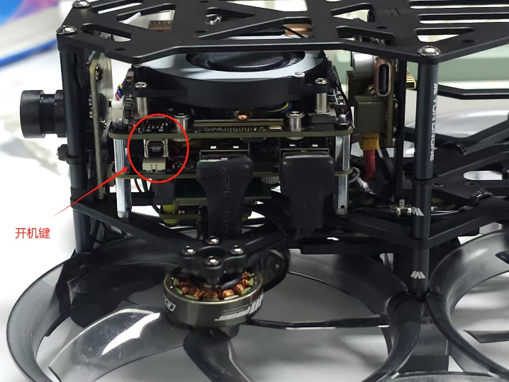</div>
&emsp;&emsp;b.拔出电源重新上电，按下开机键，等待一会
<div align=center>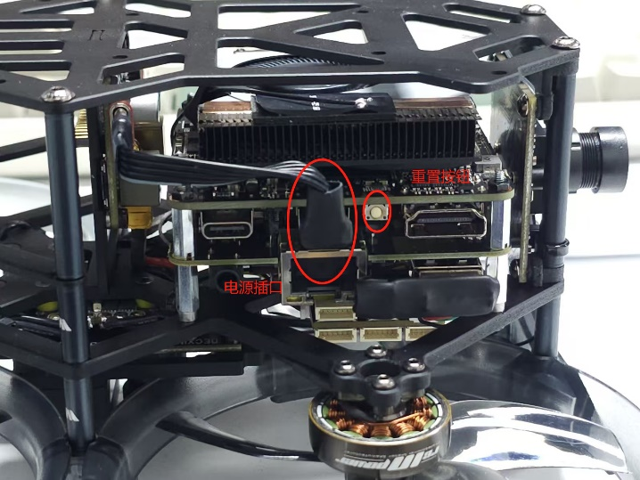</div>
&emsp;&emsp;c.电脑成功显示，如多次尝试还是不显示，请联系售后人员
<div align=center>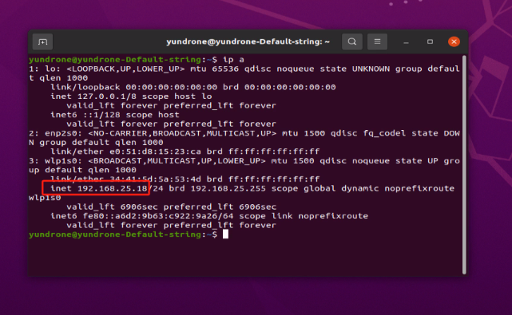</div>

---
### 3.3 NoMachine连接机载电脑
- 将无人机放进试飞区域
- 将机载电脑连接至指定路由器（如果使用动捕系统，则需要连接到同一个局域网中）
- 打开地面电脑（确保已经连接到同一局域网，如果可以有线连接请使用网线连接），确保地面电脑与机载电脑够相互ping通
- 根据软件提示连接机载电脑,**系统用户名：yundrone**，**密码：123**

---
### 3.4 接入动捕系统
#### 3.4.1 粘贴动捕球
- 将动捕球粘贴到无人机上，数量要求大于3颗，注意不要贴成对称形状.贴好动捕球的无人机放置与动捕环境中，要求无人机机头朝向与动捕坐标X轴对齐, 创建刚体，刚体朝向选择X轴
#### 3.4.2 数据广播
- 数据广播：检查VRPN数据广播的单位是否为米，错误的数据单位会引起程序错误。勾选VRPN广播，查看数据广播地址
#### 3.4.3 发送位置信息
- 打开终端 启动ros
 ``` bash
cd ~/Sunray
roscore
  ```
- 启动mavros连接无人机
``` bash
roslaunch sunray_uav_control sunray_mavros_exp.launch
  ```
- 运行外部定位模块
``` bash
roslaunch sunray_uav_control external_fusion.launch external_source:=3
  ```
  
---
### 3.5 运行示例程序
- 进入Sunray/scripts_exp/路径
``` bash
cd Sunray/scripts_exp/
```
- 起飞悬停降落：该示例会使无人机自动解锁、起飞，并悬停一段时间后降落
``` bash
./demo_takeoff_hover_land.sh
  ```
- 绘制四边形：该示例会使无人机自动解锁、起飞，然后依次使用位置控制朝着四个目标点飞行形成四边形，然后回到原地降落 
``` bash
./demo_block_pos.sh
  ```
-  绘制圆形：该示例会使无人机自动解锁、起飞，然后使用水平速度+高度控制开始以圆形的轨迹飞行，在无人机定位精度稍差的时候绘制的轨迹将不是光滑的曲线
``` bash
./demo_circle.sh
  ```
- 绘制六边形：该示例会使无人机自动解锁、起飞，然后使用机体系位置控制的形式进行六边形轨迹的移动，最后回到原地位置 
``` bash
./demo_hexayon.sh
  ```
